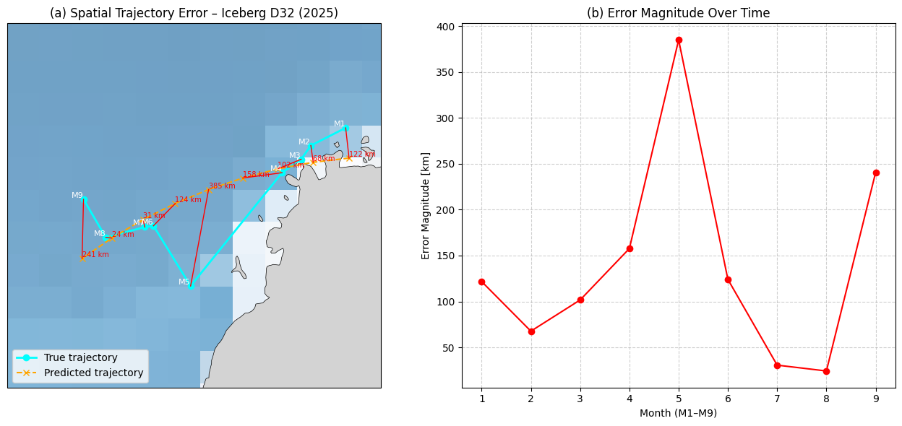

# ❄️ Iceberg D-32 Trajectory Error Visualization (2025)

> **UMBC iHARP REU Project – Visual Analytics for Climate Science**  
> *By Jervon Drakes*  

---

## 🌍 Project Overview  

This project is part of the **iHARP REU** program at UMBC, under the theme *Geospatial Reasoning and Visual Analytics for Environmental Research*.  
It focuses on modeling and visualizing the **drift path of Antarctic iceberg D-32 (2025)** using monthly satellite CSV data.  
The goal is to build an interpretable workflow that couples **statistical trajectory modeling**, **error quantification**, and **visual mapping** to support climate-science reasoning.

---

## ❓ Objectives  

- Model iceberg D-32 drift using monthly latitude/longitude data  
- Predict future positions via linear regression  
- Quantify spatial prediction error (Euclidean distance in km)  
- Visualize both **spatial** and **temporal** accuracy through a unified figure  

---

## 🧊 Scientific Significance  

Tracking iceberg drift helps:  
- Understand ocean-current influences and melt dynamics  
- Validate machine-learning drift models  
- Improve hazard mapping for navigation and climate prediction  

---

## 🧪 Data & Tools  

| Component | Description |
|------------|-------------|
| **Dataset** | Monthly CSVs (`AntarcticIcebergs_20250110.csv` → `AntarcticIcebergs_20250918.csv`) |
| **Language** | Python 3 |
| **Libraries** | `pandas`, `numpy`, `matplotlib`, `cartopy`, `scikit-learn` |
| **Environment** | Jupyter Notebook / Google Colab |

---

## 🧮 Implementation Summary  

The analysis includes:  
1. Loading monthly Antarctic iceberg position data from CSVs  
2. Fitting **linear regression models** to latitude and longitude trends  
3. Calculating **Euclidean trajectory errors (in km)**  
4. Visualizing results in a **single composite figure**, combining:  
   - A satellite-based Antarctic map showing true vs. predicted trajectories  
   - Error vectors and magnitude labels (km)  
   - A small inset or side-by-side plot of error magnitude over time  

---

## 🗺️ Visualization Output  

📷 *Composite Visualization Output – Iceberg D32 (2025)*  



**Description:**  
- **Cyan line:** Observed (true) iceberg path  
- **Orange dashed line:** Predicted regression path  
- **Red connectors:** Spatial error vectors between predicted and observed positions  
- **White arrows:** Drift direction between months  
- **Red text labels:** Error magnitude (in km)  
- The adjacent or inset line graph shows **error magnitude vs. month**, illustrating how prediction accuracy varies over time.

---

## 📈 Interpretation  

- Iceberg D-32 drifts **non-linearly**, with large direction changes mid-year.  
- Linear regression captures the general westward drift but misses curvature.  
- Largest positional error: ≈ **385 km (M5)**  
- Smallest error: ≈ **30 km (M7)**  
- Highlights the need for **non-linear or current-aware models** (e.g., ARIMA, LSTM).

---

## ⚙️ Dependencies  

```bash
pip install pandas numpy matplotlib cartopy scikit-learn

## 🤔 What I Have Learnt So Far

- 🛰️ **Working with geospatial data** requires careful projection choices to avoid misleading interpretations—especially in polar regions.  
- 🧭 **Visual design decisions** (e.g., color for start/end, labeled legends) are critical in making data understandable to both scientific and public audiences.  

---

## 🔍 Synthesis of Results and Future Work

The results so far show that a simple linear regression provides a **baseline estimate** of iceberg D-32’s drift direction but does **not capture the non-linear motion** driven by changing ocean currents, winds, and melt processes.

### Key Findings
- **Trajectory accuracy:** The predicted path follows the overall westward drift but departs by **~100–400 km** mid-year, indicating non-linear motion.  
- **Environmental influence:** Largest errors align with months where **ocean current changes** likely altered the iceberg’s course.  
- **Visualization impact:** A **single composite figure** (map + error plot) clearly communicates both spatial deviation and how error evolves over time.  

### Next Steps
- Explore **non-linear predictive models** (e.g., **ARIMA**, **LSTM**) to handle curvature and varying speeds.  
- Build an **interactive dashboard** (Streamlit or Panel) for dynamic exploration of trajectories and errors.  
- Add **uncertainty visualization** around predicted positions.  
- Scale up to **multiple icebergs** to compare regional and seasonal drift behaviors.  

---

## 🖼️ Acknowledgments

- **Satellite imagery:** Sentinel Hub (2020)  
- **Data source:** NASA ITS-LIVE  
- **Program:** NSF iHARP REU at UMBC  
- **Mentors and collaborators:** Dr. Rebecca Williams (UMBC), iHARP project leads  

---


## 🧠 Author  

**Jervon Drakes**  
Undergraduate Researcher, University of Maryland, Baltimore County (UMBC)  

🔗 [GitHub – jdrakes21](https://github.com/jdrakes21)  
📧 [Email](mailto:jdrakes1@umbc.edu)
